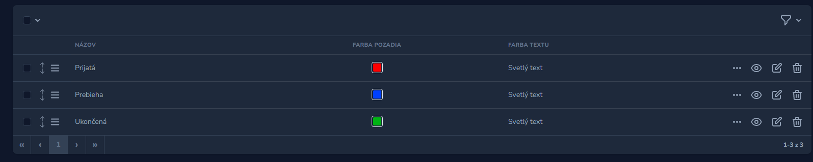
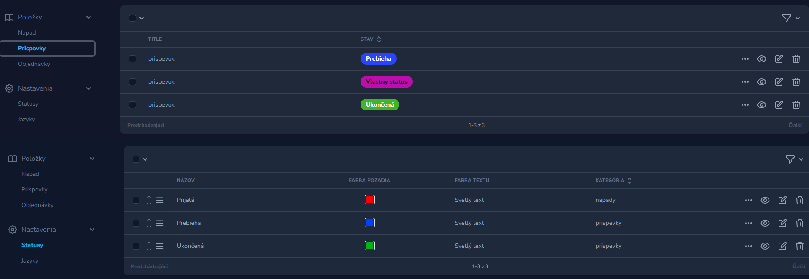
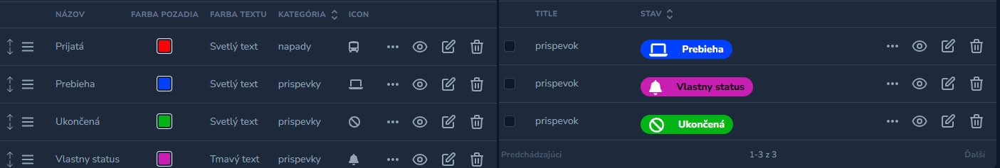

## 1. Preview



<br><br>

## 2. Required

```php
"wamesk/laravel-commands": "^1.0",
"wamesk/laravel-nova-language": "dev-main",
"wamesk/laravel-nova-slovak-lang": "^1.0",
"wamesk/utils": "^1.1",
"kongulov/nova-tab-translatable": "^2.0",
"norman-huth/nova-font-awesome-field": "^1.0"
```
<br>

## 3. Instalation

- ### register provider
```php
Wame\Statuses\StatusesServiceProvider::class,
```

- ### vendor publish   -- statusesServiceProvider
```php
php artisan vendor:publish --provider="Wame\Statuses\StatusesServiceProvider"

 php artisan db:seed --class=LanguageSeeder
 // php artisan db:seed --class=OrderStatusSeeder
```
<br>

## 4. Usage

- ### Add and run migrations
php artisan make:migration add_status_to_orders
```php
/* add column to your model*/
$table->foreignUlid('status_id')->nullable()->constrained('statuses')->cascadeOnUpdate()->nullOnDelete();
```

- ### Add to your Nova Menu   
`MenuItem::resource(Statuses::class),` <br>
  `MenuItem::resource(Languages::class),`
```php
Nova::mainMenu(function (Request $request, Menu $menu) {
    return $menu->append(
        MenuSection::make(__('status.menu.settings'), [
            MenuItem::resource('\App\Nova\Status'),
            MenuItem::resource('\App\Nova\Language')
        ])->collapsable()->collapsible()->icon('cog')
    );
});
```

- ### Add fields to your Nova Model
** **

``` php
use App\Utils\Helpers\StatusFields;

...StatusFields::get($this, '0'), // set your model category if you use more categories
``` 

- ### Add to your Model

** **

``` php
    public function statuses(): BelongsTo
    {
        return $this->belongsTo(OrderStatus::class, 'status_id');
    }
``` 
<br>

## 5. Configuration
<br>

- ### Edit translates
 edit translates  `resources/lang/sk/status.php `
```php
    'selected' => [
        '0' => 'prispevky',
        '1' => 'napady',
    ],
```
<br>

## 5. More options / extensions

- ### If you want too Icons 
uncomment this
```php
 \NormanHuth\FontAwesomeField\FontAwesome::make(__('Icon'), 'icon'),
```
and add CSS to NovaSericeProvider
```php
Nova::style('status_icons', resource_path('css/icon_fields.css'));
```
<br>

- ### If you want to use categories for more Models
uncomment this in Nova Model Status
```php
 Select::make(__('status.field.category'), 'model')
```
and set count models and add translates
```php
 $model_count = 1;
```

## Add Language
Add or delete language in language menu,
set languages in `tab-translatable.php`,

```php
    'locales' => [
            'sk'
        ],
    'required' => 'required_lang:sk',
```